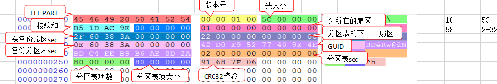
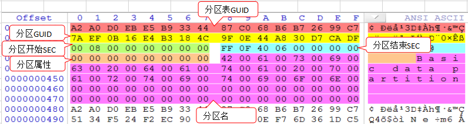

> [!TIP]
> GPT(GUID Partition Table) 全局唯一标识分区表

## 结构

| 保护MBR | GPT头 | 分区表(2-23) | 保留分区 | 数据分区 | 剩余扇区 | 备份分区表 | 备份GPT头 |
|-------|------|-----------|------|------|------|-------|--------|

### 保护MBR

- 分区表
  |分区表类型|开始位置|结束位置|
  |--|--|--|
  |EE|01 00 00 00|FF FF FF FF|

### GPT头

| 偏移 | 字节数 | 描述                                                                   |
|---:|-----|----------------------------------------------------------------------|
| 00 | 8   | 签名标志 45 46 49 20 50 41 52 54 E     F   I        P   A   R  T |
| 0C | 4   | GPT头大小字节数                                                            |
| 10 | 4   | CRC校验和                                                               |
| 18 | 8   | GPT头的扇区号                                                             |
| 20 | 8   | 备份的GPT头扇区号                                                           |
| 28 | 8   | GPT分区区域的起始扇区号                                                        |
| 30 | 8   | GPT分区区域的结束扇区号                                                        |
| 48 | 8   | GPT分区表的起始扇区号                                                         |
| 50 | 4   | 分区表项数                                                                |
| 54 | 4   | 分区表占用字节数                                                             |
| 58 | 4   | 分区表CRC校验和                                                            |

### 分区表

|偏移|字节数|描述|
|--:|--|--|
|00|16|分区类型GUID|
|10|16|分区唯一GUID|
|20|8|分区起始扇区号|
|28|8|分区结束扇区号|

## 分区GUID类型值

### 基本

| 分区类型        | GUID                                                                                     |
|-------------|------------------------------------------------------------------------------------------|
| EFI文件系统(标准) | C12A7328-F81F-11D2-BA4B-00A0C93EC93B 28-73-2A-C1-1F-F8-D2-11-BA-4B-00-A0-C9-3E-C9-3B |

### Windows

| 分区类型          | GUID                                                                                     |
|---------------|------------------------------------------------------------------------------------------|
| 微软保留分区        | E3C9E316-0B5C-4DB8-817D-F92DF00215AE 16-E3-C9-E3-5C-0B-B8-4D-81-7D-F9-2D-F0-02-15-AE |
| 基本数据分区        | EBD0A0A2-B9E5-4433-87C0-68B6B72699C7 A2-A0-D0-EB-E5-B9-33-44-87-C0-68-B6-B7-26-99-C7 |
| 逻辑软盘管理工具元数据分区 | 5808C8AA-7E8F-42E0-85D2-E1E90434CFB3 AA-C8-08-58-8F-7E-E0-42-85-D2-E1-E9-04-34-CF-B3 |
| 逻辑软盘管理工具数据分区  | AF9B60A0-1431-4F62-BC68-3311714A69AD A0-60-9B-AF-31-14-62-4F-BC-68-33-11-71-4A-69-AD |

### Linux

| 分区类型          | GUID                                                                                     |
|---------------|------------------------------------------------------------------------------------------|
| 数据分区          | EBD0A0A2-B9E5-4433-87C0-68B6B72699C7 A2-A0-D0-EB-E5-B9-33-44-87-C0-68-B6-B7-26-99-C7 |
| RAID分区        | A19D880F-05FC-4D3B-A006-743F0F84911E 0F-88-9D-A1-FC-05-3B-4D-A0-06-74-3F-0F-84-91-1E |
| 交换分区          | 0657FD6D-A4AB-43C4-84E5-0933C84B4F4F 6D-FD-57-06-AB-A4-C4-43-84-E5-09-33-C8-4B-4F-4F |
| 逻辑卷管理员(LVM)分区 | E6D6D379-F507-44C2-A23C-238F2A3DF928 79-D3-D6-E6-07-F5-C2-44-A2-3C-23-8F-2A-3D-F9-28 |
| 保留            | 8DA63339-0007-60C0-C436-083AC8230908 39-33-A6-8D-07-00-C0-60-C4-36-08-3A-C8-23-09-08 |

## 删除分区

1. GPT头的CRC校验和
2. GPT头的分区表CRC校验和
3. 分区表对应分区清零
4. 备份GPT头的CRC校验和与GPT头不同
5. 备份GPT头的分区表CRC校验和与GPT头相同
6. 备份分区表对应分区清零

## 恢复误删除的分区

1. 查找这个硬盘的分区
2. 从其它GPT磁盘中拷贝一份分区表项
3. 修改分区的起始扇区和结束扇区并修改分区唯一ID(随便改和原本不一样就行)
4. 提取分区表到新文件，计算分区表的CRC校验和，然后把计算出来的分区表校验和写到GPT文件头。
5. 提取GPT头 ，把GPT头的校验和清零，然后计算GPT头的CRC校验和 ，把校验和写到GPT头。
6. 断开恢复的硬盘，重新加载后分区后直接读取。
