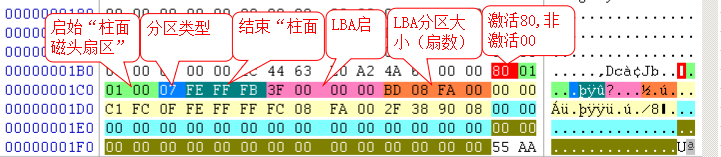

> [!TIP]
> MBR(Master Boot Record) 主引导扇区 
> 位于0号扇区

> [!NOTE]
> 最大支持2TB硬盘容量

## 结构

### 组成

- 主引导记录(MBR,Master Boot Record/Main Boot Record)
- 硬盘分区表(DPT,Disk Partition Table)
- 结束标志字(55AA)

### 具体组成

|  位置 | 长度 | 内容                | 大小(字节) |
|----:|----|-------------------|-------:|
|  00 | 8  | 引导程序              |  440字节 |
| 1B8 | 4  | Windows磁盘签名       |    4字节 |
| 1BE | 16 | 分区1结构信息           |   16字节 |
| 1CE | 16 | 分区2结构信息           |   16字节 |
| 1DE | 16 | 分区3结构信息           |   16字节 |
| 1ED | 16 | 分区4结构信息           |   16字节 |
| 1FE | 2  | 55 AAH主引导记录有效结束标识 |    2字节 |

# 分区表结构

## 结构

|  位置 | 长度/字节 | 含义                               | 重点 |
|----:|:-----:|:---------------------------------|:--:|
| 1BE |   1   | 引导标志,80为可引导,00为不可引导              | 3  |
| 1BF |   1   | 起始磁头号                            | 1  |
| 1C0 |   1   | 低六位是分区起始的扇区号 高二位是分区起始柱面号的前两位 | 1  |
| 1C1 |   1   | 分区开始的起始柱面号的低八位                   | 1  |
| 1C2 |   1   | 分区类型                             | 3  |
| 1C3 |   1   | 结束磁头号                            | 1  |
| 1C4 |   1   | 低六位是分区结束的扇区号 高二位是分区结束柱面号的前两位 | 1  |
| 1C5 |   1   | 分区结束柱面号的低八位                      | 1  |
| 1C6 |   4   | 分区开始位置 LBA起始                 | 3  |
| 1CA |   4   | 分区大小 分区总扇区数 LBA分区大小(扇区)  | 3  |

> [!TIP]
> 因MBR分区表只有四个分区位置如实际分区大于四个则会生成扩展分区 
> 扩展分区在MBR中显示为一个分区 
> 扩展分区中每个逻辑分区都有扩展分区表(EBR) 
> EBR结构与MBR大体相同但EBR的分区表只有两条记录 
> 1. 一条记录EBR对应的逻辑分区(分区开始位置为相对值)
> 2. 一条记录下一个EBR的位置(分区开始位置为相对值)

### 分区类型码

| 代号 | 分区类型                       |
|:--:|----------------------------|
| 00 | 不允许使用                      |
| 07 | HPFS/NTFS/ExFAT            |
| 0F | 扩展分区/Win95 Extended(大于8GB) |
| 05 | 逻辑分区                       |
| 0B | FAT32                      |
| 0C | FAT32(EFI)                 |
| 0E | FAT16                      |