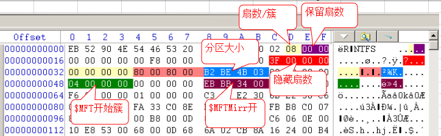

> [!TIP]
> NTFS(New Technology File System)是一个日志文件系统常见于Windows设备 
> DBR(DOS Boot Record)分区引导扇区,位于分区起始扇区

# 位置

## 查找(十六进制)

| 十六进制内容 | 偏移量     |
|:-------|:--------|
| EB5290 | 512=0   |
| 55AA   | 512=510 |

# 内容

|       卷大小        | 每簇扇区数 | 默认簇大小 |
|:----------------:|:-----:|:-----:|
|      512MB       |   1   | 512B  |
| 513~1024MB(1GB)  |   2   |  1KB  |
| 1025~2048MB(2GB) |   4   |  2KB  |
|      2049MB      |   8   |  4KB  |

|  偏移 | 长度  | 描述                               | 重点 |
|----:|-----|----------------------------------|:--:|
|  00 | 3   | 跳转指令                             | 3  |
|  03 | 8   | OEM代号                            | 1  |
|  0B | 2   | 每扇区字节数                           | 2  |
|  0D | 1   | 每簇扇区数                            | 3  |
|  0E | 7   | 保留 总是为0                     | 1  |
|  15 | 1   | 介质描述符                            | 1  |
|  16 | 2   | 保留 总是为0                     | 1  |
|  18 | 2   | 每磁道扇区数                           | 1  |
|  1A | 2   | 每柱面磁头数                           | 1  |
|  1C | 4   | 隐含扇区数 分区开始位置                | 2  |
|  20 | 4   | 保留 总是为0                     | 1  |
|  24 | 4   | 保留 总是为80008000              |    |
|  28 | 8   | 文件系统扇区数 分区大小                | 3  |
|  30 | 8   | MFT起始簇号                          | 1  |
|  38 | 8   | MFTMirr起始簇号                      | 2  |
|  40 | 1   | 每MFT项大小 ${2}^{-1}$每个文件记录的簇数 | 2  |
|  41 | 3   | 保留                               | 1  |
|  44 | 1   | 每个索引块大小簇数                        | 2  |
|  45 | 3   | 保留 总是为0                     | 1  |
|  48 | 8   | 序列号                              | 1  |
|  50 | 4   | 校验和                              | 1  |
|  54 | 426 | 引导代码                             | 1  |
| 1FE | 2   | 签名标志 55AA                   | 2  |