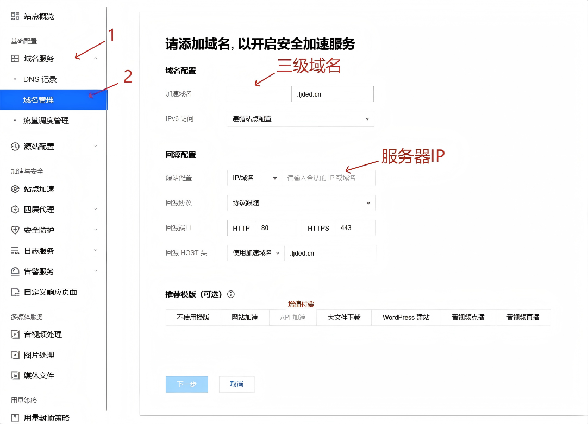

> [!TIP]
> 如想使用本站的密码管理器请 加群 1070857519 密码 433751

> [!NOTE]
> 本站部署经验根据此 [文章](https://www.mintimate.cn/2025/07/26/vaultwardenHost) 学习

使用 `vaultwarden` 这是 [bitwarden](https://bitwarden.com/) 的一个服务端实现版本使用 `Rust` 编写且解锁 `bitwarden`
的会员功能<br/>
使用 `vaultwarden` 作为服务可直接使用 `bitwarden` 的[应用程序](https://bitwarden.com/download/)<br/>
<br/>
`bitwarden` 支持多平台

- 浏览器(Firefox,Chrome,Safari等)
- Windows
- Linux
- MacOS
- IOS
- WatchOS
- Android

::github{repo="dani-garcia/vaultwarden"}

# 前期准备

- Linux 服务器(1核1G Ubuntu 或 Debian)[教程使用Debian]
- 域名(必须使用HTTPS)[最好进行工信部备案和公安备案]
- Docker(推荐使用Docker部署)[本教程使用此方法]
- Nginx(反向代理)
- [EdgeOne](https://cloud.tencent.com/act/pro/edgeone_techoday_promotion)(可选)[可代理SSL证书和CDN服务]
- 云数据库(可选)[站库分离使用]

> [!TIP]
> 由于dockerHub位于国外速度慢推荐使用云服务商的内网docker源<br/>
> [腾讯云](https://cloud.tencent.com/document/product/213/46000)
> [阿里云](https://help.aliyun.com/zh/ecs/user-guide/install-and-use-docker)
> [华为云](https://support.huaweicloud.com/intl/zh-cn/bestpractice-ecs/zh-cn_topic_0141067581.html)
> [京东云](https://docs.jdcloud.com/cn/virtual-machines/mdocker)
> 其他云服务厂商请自行查找文档中心<br/>
> 腾讯云内网docker会同步dockerHub其他未知

# 部署服务

## 安装vaultwarden

推荐创建文件夹存储

```shell
# 创建文件夹
mkdir -p /dockerData/vaultwarden
```

在文件夹中创建 `docker-compose.yml` 环境配置文件 docker 可根据此文件中的配置启动服务<br/>

> 所以中使用 `docker compose up -d` 命令启动容器服务时请将工作目录移动到此文件所在目录

```shell
# 移动到文件夹中
cd /dockerData/vaultwarden
# 创建配置文件
touch docker-compose.yml
# 使用vim编辑文件
vim docker-compose.yml
```

> docker-compose.yml 文件信息

```yaml
services:
  vaultwarden: # 服务配置
    image: vaultwarden/server:latest
    container_name: vaultwarden
    restart: unless-stopped
    environment: # 环境变量
      # 管理员密码 用于登录管理员后台(域名/admin) 如不填写则禁用后台
      # 密码可加密 https://github.com/dani-garcia/vaultwarden/wiki/Enabling-admin-page#secure-the-admin_token
      - ADMIN_TOKEN=管理员密码
      # 域名
      - DOMAIN=https://域名.com
      # 是否允许注册(禁止注册可在管理员后台邀请注册)
      - SIGNUPS_ALLOWED=false
      # 禁用Web端 (不影响浏览器插件客户端等)
      - WEB_VAULT_ENABLED=false
      # 数据库连接(不站库分离无需此条)
      - DATABASE_URL=mysql://数据库用户名:数据库密码@数据库网址:数据库端口号/vaultwarden
    volumes: #挂载数据卷
      # 数据存储位置 网站图标,附件等
      - /dockerData/vaultwarden/vw-data:/data
    ports:
      # 端口映射 1880为主机 80为容器
      - "1880:80"
```

配置好`docker-compose.yml`文件后即可使用 `docker compose up -d` 命令启动服务

## 安装nginx

> [!TIP]
> nginx 安装命令此处不提供仅推荐教程
> [CSDN](https://blog.csdn.net/qq_65732918/article/details/131862373)
> [阿里云社区](https://developer.aliyun.com/article/1621661)
> [腾讯云社区](https://cloud.tencent.com/developer/article/2559456)

`nginx` 配置文件一般位于 `/etc/nginx` 目录下的 `nginx.conf` 文件<br/>
修改此文件在 `http` 块末尾添加 `include /etc/nginx/www/*.conf;` 语句<br/>
然后在 `/etc/nginx/www` 目录下创建文件 `server.conf` 命令为 `touch /etc/nginx/www/server.conf`

> [!TIP]
> 如使用 `EdgeOne` 或其他可代理SSL证书的CDN则将无需在 `nginx` 配置SSL证书

```nginx
server {
    listen       80;
	server_name  域名;
	# SSL 配置
	listen 443 ssl;
	http2 on;
	# SSL 配置结尾

    # SSL 配置 注意这里需要替换成自己的证书
	ssl_certificate    /dockerData/vaultwarden/vw_demo.example.cn.crt;
	ssl_certificate_key    /dockerData/vaultwarden/vw_demo.example.cn.key;
	ssl_protocols TLSv1.1 TLSv1.2 TLSv1.3;
	ssl_ciphers EECDH+CHACHA20:EECDH+CHACHA20-draft:EECDH+AES128:RSA+AES128:EECDH+AES256:RSA+AES256:EECDH+3DES:RSA+3DES:!MD5;
	ssl_prefer_server_ciphers on;
	ssl_session_cache shared:SSL:10m;
	ssl_session_timeout 10m;
	add_header Strict-Transport-Security "max-age=31536000";
	error_page 497  https://$host$request_uri;
	# SSL 配置结尾

    location / {
        proxy_set_header Host $host;
        proxy_set_header X-Real-IP $remote_addr;
        proxy_set_header X-Forwarded-For $proxy_add_x_forwarded_for;

        # WebSocket
        proxy_http_version 1.1;  # 必需HTTP/1.1
        proxy_set_header Upgrade $http_upgrade;  # 传递升级头
        proxy_set_header Connection "upgrade";   # 设置连接为升级模式

        proxy_pass http://localhost:1880;  # 确保端口与Docker服务匹配
    }
}
```

# EdgeOne 配置

> [!TIP]
> [EdgeOne免费套餐](https://cloud.tencent.com/act/pro/eo-freeplan) <br/>
> `EdgeOne` 目前有三种可用区分别为 中国大陆 全球(不含中国大陆) 全球<br/>
> 其中 中国大陆和全球这两个可用区 需进行工信部备案(ICP备案)才能创建<br/>
> 不加速中国大陆正常情况下中国大陆可以访问但是响应速度慢

在 `EO` 绑定网站后点击**基础配置**中的**域名服务**然后点击**域名管理**<br/>
在域名管理页填写服务的三级域名和服务器的IP地址



然后点击新增出来的条目的 `HTTPS配置` 选择 `申请免费证书` 即可实现SSL的自动部署

# 站库分离

> [!TIP]
> `vaultwarden` 支持 
> `SQLite`(默认使用) 
> [`MySQL`](https://github.com/dani-garcia/vaultwarden/wiki/Using-the-MariaDB-%28MySQL%29-Backend) 
> [`PostgreSQL`](https://github.com/dani-garcia/vaultwarden/wiki/Using-the-PostgreSQL-Backend)

## 新网站

在配置 `docker-compose.yml` 文件时设置好远端数据库即可 `vaultwarden` 会自动建表
- `MySQL` 建库 `CREATE DATABASE vaultwarden CHARACTER SET utf8mb4 COLLATE utf8mb4_unicode_ci;`
- `PostgreSQL` 建库 `CREATE DATABASE vaultwarden OWNER vaultwarden;`

## 迁移数据库

- `SQLite` 迁移到 `MySQL` [官方文档](https://github.com/dani-garcia/vaultwarden/wiki/Using-the-MariaDB-%28MySQL%29-Backend#migrating-from-sqlite-to-mysql)
- `SQLite` 迁移到 `PostgreSQL` [官方文档](https://github.com/dani-garcia/vaultwarden/wiki/Using-the-PostgreSQL-Backend#migrating-from-sqlite-to-postgresql)
- `MySQL` 迁移到 `PostgreSQL` [官方文档](https://github.com/dani-garcia/vaultwarden/wiki/Using-the-PostgreSQL-Backend#migrating-from-mysql-to-postgresql)
- `MySQL` 迁移到 `SQLite` [官方文档](https://github.com/dani-garcia/vaultwarden/wiki/Migrating-from-MariaDB-%28MySQL%29-to-SQLite#how-to-migrate-from-mariadb-to-sqlite)

### `SQLite` 迁移到 `MySQL`

1. 将工作目录设置为 `docker-compose.yml` 所在的目录
2. 首先使用 `docker stop vaultwarden` 命令将服务停止
3. 在 `docker-compose.yml` 文件的 `environment` 中添加 `- DATABASE_URL=mysql://[[user]:[password]@]host[:port][/database]` 数据库连接
4. 使用 `docker compose up -d` 命令启动服务此时会在 `MySQL` 中自动建表
5. 当建表完成后使用 `docker stop vaultwarden` 再次停止服务
6. 在服务器上安装 `sqlite3` 工具
7. 安装后将**工作目录切换到数据存储目录后执行**
    ```shell
   sqlite3 db.sqlite3 .dump | grep "^INSERT INTO" | grep -v "__diesel_schema_migrations" > sqlitedump.sql ; echo -ne "SET FOREIGN_KEY_CHECKS=0;\n$(cat sqlitedump.sql)" > mysqldump.sql
   ```
8. 将 `mysqldump.sql` 在你的 `MySQL` 数据库中运行
9. 运行完成后回到 `docker-compose.yml` 所在的目录 运行 `docker compose up -d` 命令启动服务
10. 迁移完成
