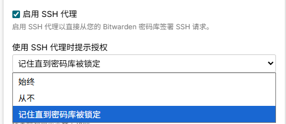
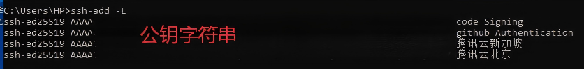
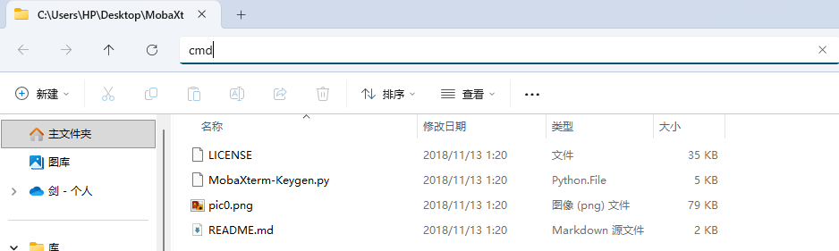
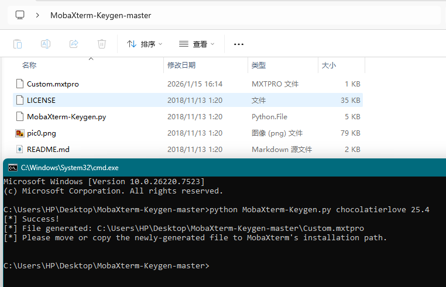
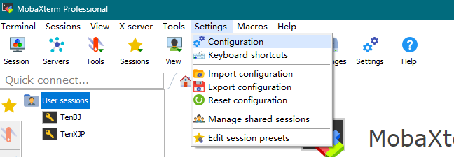
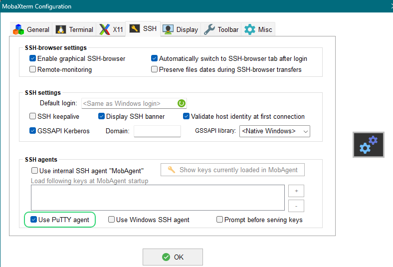
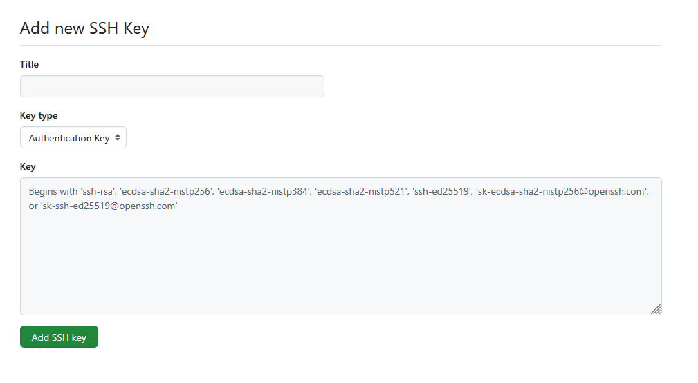
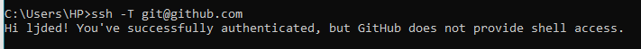
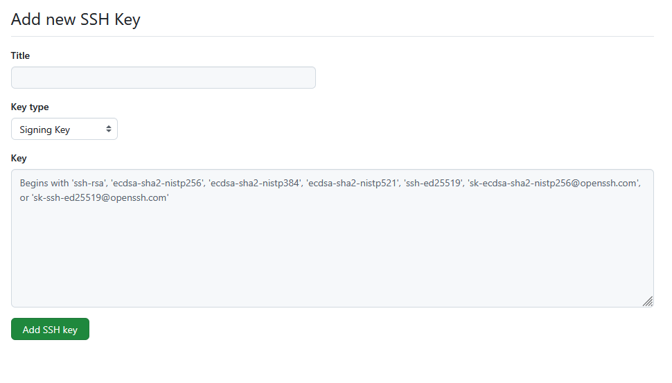

> [!WARNING]
> 本文为 `Windows` 教程

> [!NOTE]
> 本博文经验学习自以下文章
> 
> - [官方文档](https://bitwarden.com/help/ssh-agent/)
> - [MobaXterm 接入 Bitwarden SSH Agent](https://linux.do/t/topic/712492)
> - [MobaXterm的tab自动补全及破解会话上限限制](https://www.bilibili.com/opus/1051981135990489088)
> 
> 感谢以上作者的付出

> [!TIP]
> 如想使用本站的密码管理器请 加群 1070857519 密码 433751<br/>
> [MobaXterm相关资源](https://pan.baidu.com/s/1vv3qPKCH7hWkp5E9-mf29A?pwd=h6tt)

# 本文所用工具

- [Bitwarden](https://bitwarden.com)
- [MobaXterm](https://mobaxterm.mobatek.net/)

::github{repo="mzjdy/MobaXterm-Keygen"}
::github{repo="ndbeals/winssh-pageant"}

# 环境配置

1. 需安装 `2025.1.2` 及以上版本的 `bitwarden` 客户端
2. 安装 `MobaXterm`

## Bitwarden SSH Agent 配置

### 关闭 `OpenSSH Authentication Agent` 服务

1. 使用 `Win + R` 打开 `运行` 窗口
2. 在 `运行` 窗口输入 `services.msc` 打开 `服务`
3. 在 `服务` 中找到 `OpenSSH Authentication Agent` 双击将 `启动类型` 设置为 `禁用`


### 开启 `Bitwarden SSH Agent` 服务

1. 点击 `Bitwarden` 左上角 `文件` -> `设置` 进入设置界面

2. 下滑找到 `启用 SSH 代理`
3. 将 `使用 SSH 代理是提示授权` 选项修改成你想要的模式
<br/> `始终` 表示每次都需点击授权 `从不` 表示无需确认 `记住直到密码库被锁定` 表示授权直到密码库被锁定都无需授权


### 测试 `Bitwarden SSH Agent` 服务

1. 使用 `Win + R` 打开 `运行` 窗口
2. 在 `运行` 窗口输入 `cmd` 打开 `命令提示符`
3. 在 `命令提示符` 中输入 `ssh-add -L` 列出 `Bitwarden` 中存储的 `SSH 密钥`


## MobaXterm 配置

### 安装 MobaXterm

在 [官网免费版下载页](https://mobaxterm.mobatek.net/download-home-edition.html) 下载安装包 一直 `Next` 即可

顶部网盘链接提供了 `25.4` 版本的安装包和汉化包(汉化包只支持默认字符集为GBK的PC)

### MobaXterm 解锁

::github{repo="mzjdy/MobaXterm-Keygen"}

使用解锁需安装 `Python3` [下载链接](https://www.python.org/downloads/windows/) 下载 `Stable Releases` 稳定版安装即可
顶部网盘链接提供了 `3.14.2` 版本的 `Python` 安装包和 `2026/01/14` 下载的解锁包

解压解锁包在解压后的文件夹打开 `命令提示符` (如图 输入 `cmd` 后回车即可)


在弹出的 `命令提示符` 中输入 `python MobaXterm-Keygen.py chocolatierlove MobaXterm版本号` 文件夹内的 `Custom.mxtpro` 即为解锁文件


将解锁文件放置到 `MobaXterm` 安装目录即可(默认位于 `C:\Program Files (x86)\Mobatek\MobaXterm`)

### MobaXterm 配置

1. 打开安装好的 `MobaXterm` 点击 `Setting`(设置) -> `Configuration`(配置) -> `SSH` -> `Use PuTTY agent`(使用外部的 Pageant)


2. 创建 `Session` 时在 `Advanced SSH setting` 中勾选 `Use private key`
3. 服务器请自己配置公钥(我是直接腾讯云一键配置的)

## WinSSH-Pageant 安装

::github{repo="ndbeals/winssh-pageant"}

此软件将 `Pageant` 请求代理到 `Windows OpenSSH` 使仅支持 `Pageant` 的应用程序能够使用 `openssh`

> [!TIP]
> `2026年1月15日19时17分` 我在GitHub下载 `MSI` 安装包被 360 报毒<br/>
> `winget` 命令也是去 GitHub 仓库下载

有两种安装方式请自行选择
- MSI 安装包(百度网盘为本站上传) [GitHub](https://github.com/ndbeals/winssh-pageant/releases/tag/v2.3.1) [百度网盘](https://pan.baidu.com/s/1GZ-l5r_O5sWFjs_NcgEDsw?pwd=bvar)
- 在 `命令提示符` 运行 `winget install winssh-pageant`

## Git 使用 bitwarden 登录和签名

> [!WARNING]
> 想使用此功能 `Git` 源仓库请使用 SSH 链接<br/>
> 如使用反向代理不能让代理软件在 Host 文件中修改 GitHub 的解析请使用代理监听

### GitHub 身份验证

1. 进入 GitHub 网页 -> 点击右上角头像 -> `Setting` -> `SSH and GPG keys` -> `New SSH key`

2. 输入 SSH 名称类型选择 `Authentication Key` 将 `Bitwarden` 生成的公钥粘贴到 `Key` 中
3. 在 `命令提示符` 输入 `ssh -T git@github.com` 提示 `Hi <USER>! You've successfully authenticated, but GitHub does not provide shell access.`即成功



### GitHub 提交签名

1. 进入 GitHub 网页 -> 点击右上角头像 -> `Setting` -> `SSH and GPG keys` -> `New SSH key`

2. 输入 SSH 名称类型选择 `Signing Key` 将 `Bitwarden` 生成的公钥粘贴到 `Key` 中
3. 修改 `git` 全局配置
```powershell
# 使用 SSH 密钥签名
git config --global gpg.format ssh

# 指定使用的 SSH 密钥  <YOUR_PUBLIC_KEY> 替换为你的公钥 
git config --global user.signingkey "<YOUR_PUBLIC_KEY>"

# 启用提交自动签名
git config --global commit.gpgsign true

# 指定签署人
git config --global gpg.ssh.allowedSigners "$HOME/.ssh/allowedSigners"

# 写入 allowedSigners 文件 此条命令是 Windows PowerShell 的命令其他系统无法使用
Add-Content -Path "$env:USERPROFILE\.ssh\allowedSigners" -Value "GitHub主邮箱 bitwarden复制的公钥"

# 下面是 Windows 才需要的配置

# 指定 SSH 终端
git config --global core.sshCommand "C:/Windows/System32/OpenSSH/ssh.exe"
# 指定 SSH 注册机
git config --global gpg.ssh.program "C:/Windows/System32/OpenSSH/ssh-keygen.exe"
```